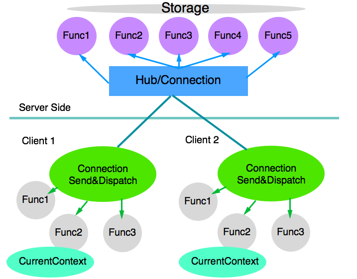
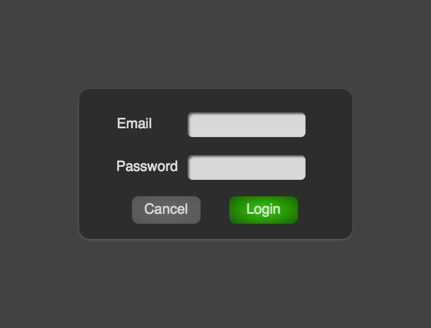
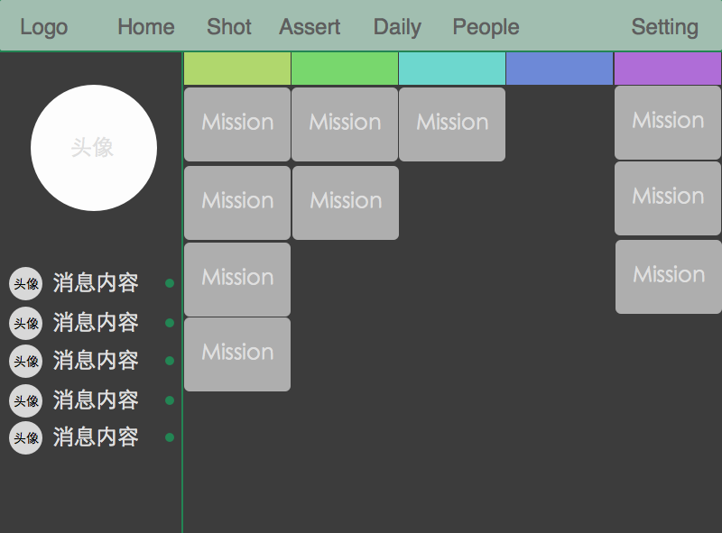
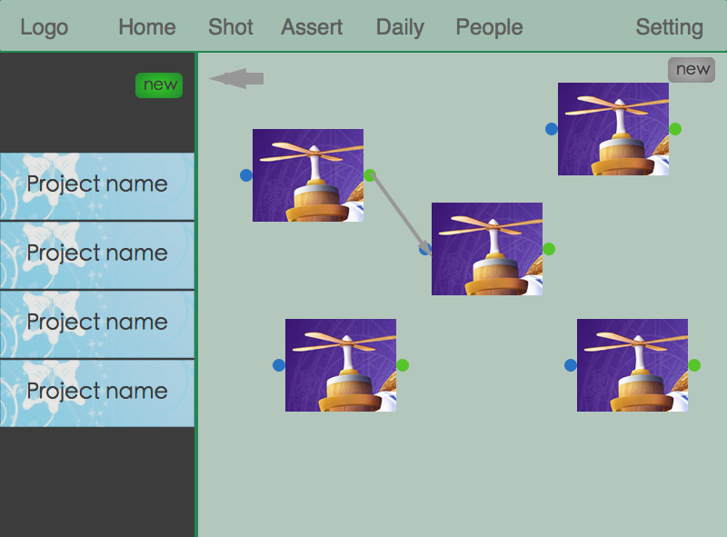
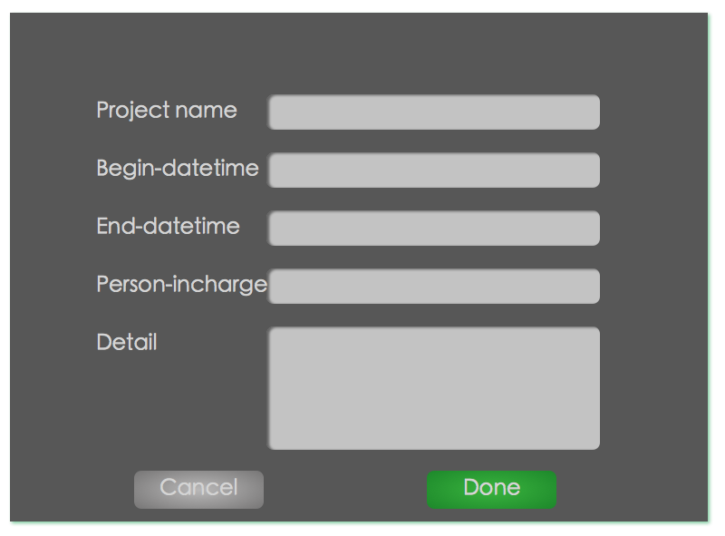

#
PillarsFlow设计文档

于鹏飞

2015年1月15日

##设计目标
该项目是为了动画电影生产协作准备的，动画电影的生产是一个复杂的工作，牵涉到为数众多艺术家（100-400人左右）长期的工作（2-4年），项目规模巨大、成本高昂，高质量的生产的协同管理需求迫切。动画电影的生产过程有特征如下：

1. 高度流水线化 动画电影的生产流程分为
	
		1. 前期创作 使用photoshop等软件绘制故事版、场景氛围、人物原型等，这一步确定了电影整体的艺术风格和整体的故事流程，完成这一步之后就可以确定需要制作多少镜头、每个镜头场景的物件、人物等；

		1. 建模 使用Maya、3D Max等软件制作人物、场景的大体的模型（简模），完成这一部分交给雕刻部门；

		1. 雕刻 雕刻部门根据前期的策划，使用ZBrush等软件对简模进行雕刻，可以得到更精致的模型（精模），这时候的模型还是一个纯色的模型，完成这一部分后交给材质贴图部门、动画部门、特效部门；

		1. 材质贴图部门 材质部门根据前期的策划，使用Maya、Mari等软件设定精模的材质（表面的反射率、高光下的表现），然后在对模型绘制贴图（如毛孔、地板的纹理、衣服的颜色等），完成贴图后交给灯光部门；

		1. 动画部门 动画部门根据前期设定，使用建模对角色和场景设定动画，完成设定后提交给灯光部门；

		1. 特效部门 特效部门拿到前期设定和建模后，对场景制作相应的特效，如海洋、火焰、毛发飘飞、破碎等效果，完成后提交给灯光部门；

		1. 灯光部门 灯光部门获得精模、动画、特效后，根据故事版在合适的位置设定光照（点光源、面光源、自然光等），使得场景看起来漂亮而自然，然后提交给合成部门；

		1. 合成部门 合成部门拿到几组灯光部门完成的素材，比如远景的山、近景的人物，配合上一些拍摄的素材，根据前期设定调和不同来源的素材，改变各个素材的亮度、对比度等，获得最终的效果。

1. 个人工作单一 动画电影生产过程中，每个人只参与八个部门中的某一个；

1. 需要大量的沟通 常见的沟通场景如下

		1. 向上游反馈 比如灯光部门发现动画使用简模制作的动画替换为精模后出现穿插现象（两个刚体在空间中重叠了，简模可能没有重叠但是精模跟建模的体积不一样大），他就需要反馈给动画部门，让动画部门做完小的修改后重新提交；

		1. Daily审核 艺术总监需要每经常性的对每个人的工作成果进行审核，防止制作过程出现偏差，如与前期设定不符、质量不达标（比如模型由一个个多边形组成，这些多边形边线的分布一定是按照人体肌肉的走向排列的，否则动画会很丑）等；

		1. Weekly审核 在某项任务完成后，所有人会聚集到一起对作品进行审核；

		1. 客户审核 每过一段时间需要给客户提供可以代表当前进度的视频，如模型（看模型是不是客户心中想象的样子）、拍屏（动画＋白色模型，此时没有完成材质贴图、特效、灯光，但是可以看到人物、动画和场景结合在一起的效果）、成片（完成了所有的操作，但是有些需要根据客户反馈微调）；

		1. 实时沟通 多数是进度的协调（每个人可能同时参与多个项目）、技术艺术方面的讨论（每个类型的特效都有很多种做法）和及时的反馈（发现上游有问题可能要停止工作等待修改）

鉴于协同管理系统需求的特殊性，我们设计的软件具有以下特征

1. 简洁易懂的界面设计，方便艺术家快速的上手

1. 跨平台、原生版本 保证软件的高效、流畅、对移动设备友好

1. 实时的沟通 提供实时的聊天、发图片、语音、视频的沟通

1. 基于节点和节点之间依赖关系的管理，每个任务就是一个节点，多个任务之间的相互依赖关系组成了一张有向无环图。节点分为两种，一种是战役（campaign)，另一种是任务mission。所谓的战役是包含一系列子任务作为子节点的任务，这一系列子节点构成了一个有向无环图。所谓的mission是不包含子节点的任务。

1. 强大的审核机制 在任务提交需要审核的样本之后会出现在审核页面，所有的人都可以对其进行评论。

基本概念：

1. 资产 生产出来在项目中用途较为特殊的一类媒体资源

##数据表设定

1. 用户的基本信息存储于MySQL
MySQL: DB: Pillars
CREATE DATABASE IF NOT EXISTS PillarsFlow DEFAULT CHARSET utf8;
Table: user 存储用户名、密码、组别等信息，后续改为用email登录
Create Table `user` (
	`user_id` int unsigned NOT NULL AUTO_INCREMENT,
	`user_code` char(32) not null unique,#计算生成的唯一识别符
	`email` char(30) not null,#用户邮箱，用于登录
	`password` char(32) not null,#用户的密码
	`group` varchar(20) not null,#用户的组别，目前有系统管理员、统筹、八个部门的组
	`display_name` char(20) not null,#用于展示的名称
	`position` varchar(50) not null,#所在位置
	`picture` mediumtext not null,#头像照片的base64编码
	`phone` char(20)not null,#用户电话号码
	`insert_datetime` TIMESTAMP DEFAULT CURRENT_TIMESTAMP,
	`update_datetime` TIMESTAMP DEFAULT CURRENT_TIMESTAMP ON UPDATE CURRENT_TIMESTAMP,
	PRIMARY KEY (`user_id`),
	INDEX(`email`),
	INDEX(`group`)
) ENGINE=InnoDB DEFAULT CHARSET=utf8;

1. 项目的相关信息存放在project表
MySQL: DB: Pillars
Table: project 存储项目的相关信息
Create table `project`(
	`project_id` int unsigned NOT NULL AUTO_INCREMENT,
	`project_code` char(32) NOT NULL,
	`project_name` char(50) NOT NULL,#存储项目的名称
	`project_detail` varchar(2000) NOT NULL,#存储项目的详细说明
	`plan_begin_datetime` datetime  NOT NULL,#存储项目计划开始的时间
	`plan_end_datetime` datetime NOT NULL,#存储项目计划结束的时间
	`real_begin_datetime` datetime NOT NULL,#存储项目实际开始的时间
	`real_end_datetime` datetime NOT NULL,#存储项目实际结束的时间
	`person_in_charge` char(32) NOT NULL,#存储`user_code`，项目负责人的usercode
	`status` int default 0 NOT NULL, #0未开始，1已经完成,2进行中
	`picture` mediumtext NOT NULL,#直接往mysql中写入照片的base64编码     ??????????????????????
	`insert_datetime` TIMESTAMP DEFAULT CURRENT_TIMESTAMP,
	`update_datetime` TIMESTAMP DEFAULT CURRENT_TIMESTAMP ON UPDATE CURRENT_TIMESTAMP,
	PRIMARY KEY (`project_id`),
	INDEX(`project_code`)
) ENGINE=InnoDB DEFAULT CHARSET=utf8;

1. 任务的相关信息存放在mission表
MySQL: DB: Pillars
Table: mission 存储任务相关信息
Create Table `mission` (
	`mission_id` int unsigned NOT NULL AUTO_INCREMENT,
	`mission_code` char(32) not null unique,
	`mission_name` char(50) NOT NULL,#任务的名称
	`project_code` char(32) NOT NULL,#任务所属project
	`product_type` tinyint NOT NULL,#标识任务产品的种类，如资产还是镜头，0代表镜头，1代表资产  //*********************
	`is_campaign` tinyint default 0 NOT NULL, #是否是一个战役，0不是，1是                 //**********************
	`mission_detail` varchar(200) NOT NULL,#给任务一段更详细的文本说明
	`plan_begin_datetime` datetime NOT NULL,#计划开始时间
	`plan_end_datetime` datetime NOT NULL,#计划结束时间
	`real_begin_datetime` datetime NOT NULL,#实际开始时间
	`real_end_datetime` datetime NOT NULL,#实际结束时间
	`person_in_charge` char(32) NOT NULL,#存储`user_code`，任务的负责人
	`status` int default 0 NOT NULL, #0指定了人但未开始，1已经完成,2已经通过，3进行中，4未指定人
	`picture` mediumtext NOT NULL,#照片的base64编码
	`insert_datetime` TIMESTAMP DEFAULT CURRENT_TIMESTAMP,
	`update_datetime` TIMESTAMP DEFAULT CURRENT_TIMESTAMP ON UPDATE CURRENT_TIMESTAMP,
	PRIMARY KEY (`mission_id`),
	INDEX(`mission_code`),
	INDEX(`person_in_charge`)   //?????????
) ENGINE=InnoDB DEFAULT CHARSET=utf8;

1. 任务的有向无环图的节点信息存放在graph表
MySQL: DB: Pillars
Table: graph存储任务有向无环图的节点信息
一个大的mission可能有更多小的mission构成，这些小的mission构成一个图。两个具体的例子
	
		1. 软件打开后，在镜头页面展示所有的project列表，点击任意一个project，则向服务器请求该project的projectcode对应的graph，此时graph表中campaign_code即为projetcode，product_type为镜头，服务器查询到所有的node和dependency后返回；  //*****************

		1. 用户双击其中的任意一个node，则向服务器请求该node作为campaign_code，product_type为镜头的所有node和dependency并返回；

Create table `graph` (
	`campaign_id` int unsigned not null auto_increment,
	`graph_code` char(32) not null unique,#
	`campaign_code` char(32) not null,#实际上是一个mission code，指大的mission
	`project_code` char(32) NOT NULL,#任务所属project
	`node_code` char(32) not null,#实际上是一个mission code,每个campaign_code对应很多个node_code  //X!!!!!!!!!!!!!!!!!!!!!!!!!!!!!!!!!!!!!
	`product_type` tinyint NOT NULL,#标识任务产品的种类，如资产还是镜头，0代表镜头，1代表资产
	`x_coordinate` int NOT NULL,#该节点所在的x轴的位置
	`y_coordinate` int NOT NULL,#该节点所在的y轴的位置
	`width` int NOT NULL,#该节点的宽度
	`height` int NOT NULL,#该节点的高度
	`insert_datetime` TIMESTAMP DEFAULT CURRENT_TIMESTAMP,
	`update_datetime` TIMESTAMP DEFAULT CURRENT_TIMESTAMP ON UPDATE CURRENT_TIMESTAMP,
	PRIMARY KEY (`campaign_id`),
	INDEX(`node_code`),
	INDEX(`campaign_code`),
	INDEX(`project_code`)
) ENGINE=InnoDB DEFAULT CHARSET=utf8;

1. 任务的有向无环图的连接信息存放在dependency表
MySQL: DB: Pillars
Table: dependency 存储任务依赖图
Create table `dependency` (
	`dependency_id` int unsigned NOT NULL AUTO_INCREMENT,
	`dependency_code` char(32) NOT NULL,
	`campaign_code` char(32) not null,#实际上是一个mission code，指大的mission
	`project_code` char(32) NOT NULL,#任务所属项目，增加这个冗余项可以减少很多次查询
	`product_type` tinyint NOT NULL,#标识任务产品的种类，如资产还是镜头，0代表镜头，1代表资产
	`start_mission_code` char(32) NOT NULL,
	`end_mission_code` char(32) NOT NULL,
	`dependency_type` int NOT NULL,#0前置依赖,1引用
	`insert_datetime` TIMESTAMP DEFAULT CURRENT_TIMESTAMP,
	`update_datetime` TIMESTAMP DEFAULT CURRENT_TIMESTAMP ON UPDATE CURRENT_TIMESTAMP,
	PRIMARY KEY (`dependency_id`),
	INDEX(`start_mission_code`),
	INDEX(`end_mission_code`),
	INDEX(`campaign_code`),
	Unique index(`start_mission_code`, `end_mission_code`)
) ENGINE=InnoDB DEFAULT CHARSET=utf8;

1. 任务的目标信息存放在target表
MySQL: DB: Pillars
Table: target 存储任务生成的文件

Create table `target`(
	`target_id` int unsigned NOT NULL AUTO_INCREMENT,
	`target_code` char(32) NOT NULL unique,
	`mission_code` char(32) NOT NULL,#该任务的code
	`project_code` char(32) NOT NULL,#该任务对应的production的code
	`version_tag` char(20) NOT NULL,#该成果的版本信息，由用户指定
	`storage_position` varchar(200)  NOT NULL,#该成果存在什么地方
	`picture` mediumtext NOT NULL,#照片存base64编码
	`insert_datetime` TIMESTAMP DEFAULT CURRENT_TIMESTAMP,
	`update_datetime` TIMESTAMP DEFAULT CURRENT_TIMESTAMP ON UPDATE CURRENT_TIMESTAMP,
	PRIMARY KEY (`target_id`),
	INDEX(`mission_code`)
) ENGINE=InnoDB DEFAULT CHARSET=utf8;

1. 任务需要审核的文件放在daily表
MySQL: DB: Pillars
Table: daily 存储用于审核的文件的信息

Create table `daily`(
	`daily_id` int unsigned NOT NULL AUTO_INCREMENT,
	`daily_code` char(32) NOT NULL unique,
	`mission_code` char(32) NOT NULL,
	`project_code` char(32) NOT NULL,
	`version_tag` char(20) NOT NULL,
	`storage_position` varchar(200)  NOT NULL,
	`picture` mediumtext NOT NULL,#照片存base64编码
	`insert_datetime` TIMESTAMP DEFAULT CURRENT_TIMESTAMP,
	`update_datetime` TIMESTAMP DEFAULT CURRENT_TIMESTAMP ON UPDATE CURRENT_TIMESTAMP,
	PRIMARY KEY (`daily_id`),
	INDEX(`mission_code`)
) ENGINE=InnoDB DEFAULT CHARSET=utf8;

1. 使用MongoDB存储非结构化数据，包括聊天内容、评论信息，这些信息永不删除。
Use PillarsFlow
聊天内容存储到Chart表
MongoDB: DB: PillarsFlow
Chart
{
    _id string #单条chart的唯一标示符，key值
    IsPicture int #是否是一张图片，每次只能发送一张图片或者一段文字
    Message string #单条chart的具体内容
    From string #谁发送的消息，usercode
    SendTime string #发送的时间
    To string #发送给谁的消息，usercode
    ReceivedTime string #收到信息的时间
    IsRecieved int #0已经收到，1未收到
    Deleted int #0未删除， 1已删除
    DeletedTime string
}

1. 任务的评论信息存储到Post表 可以对mission自身、mission的daily信息和mission的target信息进行评论   //****************************************
MongoDB: DB: PillarsFlow
Post
{
	_id: 每条Post生成一个Code
	MissionCode:存储具体的missioncode
	PostType：int#0mission自身的消息，1missionDaily的消息，2target的消息
	Code：post关联到某个daily或者mission自身或者target
	IsPicture int #0不是图片，1是图片
	Message：消息主体
	ReplyTo：回复某一个PostCode
	UserCode: 发布人的code
	PostTime: 回复发布的时间
	Deleted:0//1为被删除
	DeletedTime:被删除的时间
}

##通信机制
前后端通过websocket建立链接，相互传递json数据进行通信
1. 客户端向服务器端的请求格式如下
{
	"command" : "command name",
	"parameter": “{
		“parameter string”
	}”
}
服务器端解析该json字符串，获取command和parameter，根据command将不同的parameter分发到不同的处理函数。
例如登陆的请求格式为
{
	"command" : "login",
	"parameter": “{
		"Email": "yupengfei@qq.com",
		"Password": "123456"
	}”
}
1. 服务器端向客户端返回的格式如下
{
	"error": {
		"errorCode" : 0,
		"errorMessage": ""
	},
	"command": "command name",
	“UserCode”: string,//发起该操作的user
	"result": “{
		“parameter string”
	}”
}
客户端首先解析错误信息，如果没有错误则根据将result的内容转发到对应的函数，例如登陆的返回值为

{
	"error": {
		"errorCode" : 0,
		"errorMessage": ""
	},
	"command": "login",
	“UserCode”: string,//发起该操作的user
	"result":“ {
		UserCode string
		Email string
		Password string，返回只里面该字段为空
		Group string
		DisplayName string
		Position string
		Picture string
		Phone string
		InsertDatetime string
		UpdateDatetime string

	}”
}
如果登录
其中error对应的服务器或者网络的错误，errorCode为0代表没有错误，errorcode为1代表服务器内部错误，errorcode为2代表权限不足，errorcode为3代表其它错误，可以在errormessage字段加以标示如
{
	"error": {
		"errorCode" : 3
		"errorMessage": "用户名或密码错误，重试"
	},
	"command": "login",
	“UserCode”: string,//发起该操作的user
	"result":“ {
		UserCode string
		Email string
		Password string，返回只里面该字段为空
		Group string
		DisplayName string
		Position string
		Picture string
		Phone string
		InsertDatetime string
		UpdateDatetime string

	}”
}
##其它接口                                         //************************************************************************
1. 获取所有project
{
	“command”: “getAllProject”,
	“parameter”:”{
		
	}”
}
返回值为
{
	"error": {
		"errorCode" : 0,
		"errorMessage": ""
	},
	“commnd”: “getAllProject”,
	“UserCode”: string,//发起该操作的user
	“result”:”[
			{
				“ProjectCode”: string,
				“ProjectName”: string,
    			“ProjectDetail": string,
    			“PlanBeginDatetime”: string,
    			“PlanEndDatetime”: string,
    			“RealBeginDatetime”: string,
    			“RealEndDatetime”: string,
    			“PersonInCharge”: string,
    			“Status”: int,
    			“Picture”: string
				“InsertDatetime”: string
    			“UpdateDatetime”: string

			}
		]
1. 添加project
{
	“command”:”addProject”,
	“parameter”:”{
		“ProjectCode”: 任意string，不起作用,可以没有
		“ProjectName”: string,
		“ProjectDetail": string,
		“PlanBeginDatetime”: string,
		“PlanEndDatetime”: string,
		“RealBeginDatetime”: string,
		“RealEndDatetime”: string,
		“PersonInCharge”: string,
		“Status”: int,
		“Picture”: string,
		“InsertDatetime”: 任意string，不起作用,可以没有
		“UpdateDatetime”: 任意string，不起作用,可以没有
	}”
}
返回值
{
	"error": {
		"errorCode" : 0,
		"errorMessage": ""
	},
	“commnd”: “addProject”,
	“UserCode”: string,//发起该操作的user
	“result”:”{
		“ProjectCode”: string
		“ProjectName”: string,
		“ProjectDetail": string,
		“PlanBeginDatetime”: string,
		“PlanEndDatetime”: string,
		“RealBeginDatetime”: string,
		“RealEndDatetime”: string,
		“PersonInCharge”: string,
		“Status”: int,
		“Picture”: string,
		“InsertDatetime”: string
    	“UpdateDatetime”: string

	}”
}
1. 修改project
{
	“command”:”modifyProject”,
	“parameter”:”{
		“ProjectCode”: 任意string，不起作用,可以没有
		“ProjectName”: string,
		“ProjectDetail": string,
		“PlanBeginDatetime”: string,
		“PlanEndDatetime”: string,
		“RealBeginDatetime”: string,
		“RealEndDatetime”: string,
		“PersonInCharge”: string,
		“Status”: int,
		“Picture”: string
		“InsertDatetime”: 任意string，不起作用,可以没有
    	“UpdateDatetime”: 任意string，不起作用,可以没有
	}”
}
返回值
{
	"error": {
		"errorCode" : 0,
		"errorMessage": ""
	},
	“commnd”: “modifyProject”,
	“UserCode”: string,//发起该操作的user
	“result”:”{
		“ProjectCode”: string
		“ProjectName”: string,
    		“ProjectDetail": string,
    		“PlanBeginDatetime”: string,
    		“PlanEndDatetime”: string,
    		“RealBeginDatetime”: string,
    		“RealEndDatetime”: string,
    		“PersonInCharge”: string,
    		“Status”: int,
    		“Picture”: string,
		“InsertDatetime”: string
    		“UpdateDatetime”: string
	}”
}

1. 根据projectCode获取所有的镜头的compaign
{
	“command”:”getProjectShotCampaign”,
	“parameter”:”{
		“ProjectCode”:string
	}”
}
返回值
{
	"error": {
		"errorCode" : 0,
		"errorMessage": ""
	},
	“commnd”: “getAllCompaign”,
	“UserCode”: string,//发起该操作的user
	“result”:”[{
		    MissionCode string
    		MissionName string
    		ProjectCode string
    		ProductType string
    		IsCampaign int
    		MissionType string
    		MissionDetail string
    		PlanBeginDatetime string
    		PlanEndDatetime string
    		RealBeginDatetime string
    		RealEndDatetime string
    		PersonIncharge string
    		Status int
    		Picture string
    		InsertDatetime string
    		UpdateDatetime string		
	}”
}

///////////////////////new 
1. 根据projectCode获取所有的镜头的compaign
{
	“command”:”getProjectAssertCampaign”,
	“parameter”:”{
		“ProjectCode”:string
	}”
}
返回值
{
	"error": {
		"errorCode" : 0,
		"errorMessage": ""
	},
	“commnd”: “getAllCompaign”,
	“UserCode”: string,//发起该操作的user
	“result”:”[{
		MissionCode string
    		MissionName string
    		ProjectCode string
    		ProductType string
    		IsCampaign int
    		MissionType string
    		MissionDetail string
    		PlanBeginDatetime string
    		PlanEndDatetime string
    		RealBeginDatetime string
    		RealEndDatetime string
    		PersonIncharge string
    		Status int
    		Picture string
    		InsertDatetime string
    		UpdateDatetime string		
	}”
}

1. 新建mission
{
	“command”:”addMission”,
	“parameter”:”{
		MissionCode 任意string，不起作用,可以没有
		MissionName string
		ProjectCode string
		ProductType int
		IsCampaign int
		MissionDetail string
		PlanBeginDatetime string
		PlanEndDatetime string
		RealBeginDatetime string
		RealEndDatetime string
		PersonIncharge string
		Status int
		Picture string
		InsertDatetime 任意string，不起作用,可以没有
		UpdateDatetime 任意string，不起作用,可以没有
	}”
}
返回值
{
	"error": {
		"errorCode" : 0,
		"errorMessage": ""
	},
	“commnd”: “addMission”,
	“UserCode”: string,//发起该操作的user
	“result”:”{
		MissionCode string
    		MissionName string
    		ProjectCode string
    		ProductType int
    		IsCampaign int
    		MissionDetail string
    		PlanBeginDatetime string
    		PlanEndDatetime string
    		RealBeginDatetime string
    		RealEndDatetime string
    		PersonIncharge string
    		Status int
    		Picture string
    		InsertDatetime string
    		UpdateDatetime string
	}”
}

1. 修改mission
{
	“command”:”modifyMission”,
	“parameter”:{
		MissionCode string
		MissionName string
		ProjectCode string
		ProductType int
		IsCampaign int
		MissionDetail string
		PlanBeginDatetime string
		PlanEndDatetime string
		RealBeginDatetime string
		RealEndDatetime string
		PersonIncharge string
		Status int
		Picture string
		InsertDatetime 任意string，不起作用,可以没有
		UpdateDatetime 任意string，不起作用,可以没有
	}”
}
返回值
{
	"error": {
		"errorCode" : 0,
		"errorMessage": ""
	},
	“commnd”: “modifyMission”,
	“UserCode”: string,//发起该操作的user
	“result”:”{
		MissionCode string
		MissionName string
		ProjectCode string
		ProductType int
		IsCampaign int
		MissionDetail string
		PlanBeginDatetime string
		PlanEndDatetime string
		RealBeginDatetime string
		RealEndDatetime string
		PersonIncharge string
		Status int
		Picture string
		InsertDatetime string
		UpdateDatetime string
	}”
}
1. 删除mission
{
	“command”:”deleteMission”,
	“parameter”:”{
		MissionCode string
	}”
}
返回值
{
	"error": {
		"errorCode" : 0,
		"errorMessage": ""
	},
	“commnd”: “deleteMission”,
	“UserCode”: string,//发起该操作的user
	“result”:”{
		MissionCode string
	}”
}
1. QueryMissionByMissionCode
{
	“command”:”queryMissionByMissionCode”,
	“parameter”:”{
		MissionCode string
	}”
}
返回值
{
	"error": {
		"errorCode" : 0,
		"errorMessage": ""
	},
	“commnd”: “queryMissionByMissionCode”,
	“UserCode”: string,//发起该操作的user
	“result”:”{
		MissionCode string
		MissionName string
		ProjectCode string
		ProductType int
		IsCampaign int
		MissionDetail string
		PlanBeginDatetime string
		PlanEndDatetime string
		RealBeginDatetime string
		RealEndDatetime string
		PersonIncharge string
		Status int
		Picture string
		InsertDatetime string
		UpdateDatetime string

	}”
}

1. 获取Campaign的全部node，服务器返回了所有的node信息和node对应的mission的信息
{
	“command”:”GetCampaignNode”,
	“parameter”:”{
		CampaignCode string
	}”
}
返回值
{
	"error": {
		"errorCode" : 0,
		"errorMessage": ""
	},
	“commnd”: “getAllNode”,
	“UserCode”: string,//发起该操作的user
	“result”:”[{
		GraphCode string
		CampaignCode string
		ProjectCode string
		NodeCode string
		ProductType int
		Width int
		Height int
		XCoordinate int
		YCoordinate int
		InsertDatetime string
		UpdateDatetime string

	}
{
		MissionCode string
		MissionName string
		ProjectCode string
		ProductType int
		IsCampaign int
		MissionDetail string
		PlanBeginDatetime string
		PlanEndDatetime string
		RealBeginDatetime string
		RealEndDatetime string
		PersonIncharge string
		Status int
		Picture string
		InsertDatetime string
		UpdateDatetime string

	}]”
}

1. 新建node                                           
{
	“command”:”addNode”,
	“parameter”:”[{
		GraphCode string 任意string，不起作用,可以没有
		CampaignCode string
		ProjectCode string
		NodeCode string
		ProductType int
		Width int
		Height int
		XCoordinate int
		YCoordinate int
		InsertDatetime 任意string，不起作用,可以没有
		UpdateDatetime 任意string，不起作用,可以没有
	}
{
		MissionCode string
		MissionName string
		ProjectCode string
		ProductType int
		IsCampaign int
		MissionDetail string
		PlanBeginDatetime string
		PlanEndDatetime string
		RealBeginDatetime string
		RealEndDatetime string
		PersonIncharge string
		Status int
		Picture string
		InsertDatetime string
		UpdateDatetime string

	}”
}
返回值
{
	"error": {
		"errorCode" : 0,
		"errorMessage": ""
	},
	“commnd”: “addNode”,
	“UserCode”: string,//发起该操作的user
	“result”:”{
		GraphCode string
		CampaignCode string
		ProjectCode string
		NodeCode string
		ProductType int
		Width int
		Height int
		XCoordinate int
		YCoordinate int
		InsertDatetime string
		UpdateDatetime string
	}”
}

1. 修改node
{
	“command”:”modifyNode”,
	“parameter”:”{
		GraphCode string
		CampaignCode string
		ProjectCode string
		NodeCode string
		ProductType int
		Width int
		Height int
		XCoordinate int
		YCoordinate int
		InsertDatetime 任意string，不起作用,可以没有
		UpdateDatetime 任意string，不起作用,可以没有
	}”
}
返回值
{
	"error": {
		"errorCode" : 0,
		"errorMessage": ""
	},
	“commnd”: “modifyNode”,
	“UserCode”: string,//发起该操作的user
	“result”:”{
		GraphCode string
		CampaignCode string
		ProjectCode string
		NodeCode string
		ProductType int
		Width int
		Height int
		XCoordinate int
		YCoordinate int
		InsertDatetime string
		UpdateDatetime string
	}”
}
1. 删除node
{
	“command”:”deleteNode”,
	“parameter”:”{
		GraphCode string
	}”
}
返回值
{
	"error": {
		"errorCode" : 0,
		"errorMessage": ""
	},
	“commnd”: “deleteNode”,
	“UserCode”: string,//发起该操作的user
	“result”:”{
		GraphCode string	
	}”
}
1. 获取Campaign的全部dependency
{
	“command”:getCampaignDependency,
	“parameter”:”{
		CampaignCode string
	}”
}
返回值
{
	"error": {
		"errorCode" : 0,
		"errorMessage": ""
	},
	“commnd”: “getAllDependency”,
	“UserCode”: string,//发起该操作的user
	“result”:”[{
		DependencyCode string
		CampaignCode string
		ProjectCode string
		ProductType int
		StartMissionCode string
		EndMissionCode string
		DependencyType int
		InsertDatetime string
		UpdateDatetime string
	}]”
}
1. 添加dependency
{
	“command”:”addDependency”,
	“parameter”:{
		DependencyCode 任意string，不起作用,可以没有
		CampaignCode string
		ProjectCode string
		ProductType int
		StartMissionCode string
		EndMissionCode string
		DependencyType int
		InsertDatetime 任意string，不起作用,可以没有
		UpdateDatetime 任意string，不起作用,可以没有
	}
}
返回值
{
	"error": {
		"errorCode" : 0,
		"errorMessage": ""
	},
	“commnd”: “addDependency”,
	“UserCode”: string,//发起该操作的user
	“result”:”{
		DependencyCode string
		CampaignCode string
		ProjectCode string
		ProductType int
		StartMissionCode string
		EndMissionCode string
		DependencyType int
		InsertDatetime string
		UpdateDatetime string
	}”
}
	
1. 删除dependency
{
	“command”:”deleteDependency”,
	“parameter”:”{
		DependencyCode string
	}”
}
返回值
{
	"error": {
		"errorCode" : 0,
		"errorMessage": ""
	},
	“commnd”: “deleteDependency”,
	“UserCode”: string,//发起该操作的user
	“result”:”{
		DependencyCode string
	}”
}
1. 修改dependency
{
	“command”:”modifyDependency”,
	“parameter”:{
		DependencyCode string
    		CampaignCode string
    		ProjectCode string
    		ProductType int
    		StartMissionCode string
    		EndMissionCode string
    		DependencyType int
    		InsertDatetime 任意string，不起作用,可以没有
    		UpdateDatetime 任意string，不起作用,可以没有
	}
}
返回值
{
	"error": {
		"errorCode" : 0,
		"errorMessage": ""
	},
	“commnd”: “addDependency”,
	“UserCode”: string,//发起该操作的user
	“result”:”{
		DependencyCode string
    		CampaignCode string
    		ProjectCode string
    		ProductType int
    		StartMissionCode string
    		EndMissionCode string
    		DependencyType int
    		InsertDatetime string
    		UpdateDatetime string
	}”
}

1. 添加target
{
	“command”:”addTarget”,
	“parameter”:”{
		TargetCode 任意string，不起作用,可以没有
		MissionCode string
		ProjectCode string
		VersionTag string
		StoragePosition string
		Picture string
		InsertDatetime 任意string，不起作用,可以没有
		UpdateDatetime 任意string，不起作用,可以没有
	}”
}
返回值
{
	"error": {
		"errorCode" : 0,
		"errorMessage": ""
	},
	“commnd”: “addTarget”,
	“UserCode”: string,//发起该操作的user
	“result”:”{
		TargetCode string
		MissionCode string
		ProjectCode string
		VersionTag string
		StoragePosition string
		Picture string
		InsertDatetime string
		UpdateDatetime string
	}”
}
1. 修改target
{
	“command”:”modifyTarget”,
	“parameter”:”{
		TargetCode string
    		MissionCode string
    		ProjectCode string
    		VersionTag string
    		StoragePosition string
    		Picture string
    		InsertDatetime 任意string，不起作用,可以没有
    		UpdateDatetime 任意string，不起作用,可以没有
	}”
}
返回值
{
	"error": {
		"errorCode" : 0,
		"errorMessage": ""
	},
	“commnd”: “modifyTarget”,
	“UserCode”: string,//发起该操作的user
	“result”:”{
		TargetCode string
		MissionCode string
		ProjectCode string
		VersionTag string
		StoragePosition string
		Picture string
		InsertDatetime string
		UpdateDatetime string

	}”
}
1. 删除target
{
	”command“:”deleteTarget”,
	“parameter”:”{
		TargetCode string
	}”
}
返回值
{
	"error": {
		"errorCode" : 0,
		"errorMessage": ""
	},
	“commnd”: “deleteTarget”,
	“UserCode”: string,//发起该操作的user
	“result”:”{
		TargetCode string
	}”
}
1. 查询指定mission的target
{
	”command“:”queryTargetByMissionCode”,
	“parameter”:”{
		MissionCode string
	}”
}
返回值
{
	"error": {
		"errorCode" : 0,
		"errorMessage": ""
	},
	“commnd”: “queryTargetByMissionCode”,
	“UserCode”: string,//发起该操作的user
	“result”:”[{
		TargetCode string
		MissionCode string
		ProjectCode string
		VersionTag string
		StoragePosition string
		Picture string
		InsertDatetime string
		UpdateDatetime string
	}]”
}
1. addChart
{
	“command”:”addChart”,
	“parameter”:”{
		Id 任意string,可以没有 
		IsPicture int #0不是，1是
		Message string
		From 任意string,可以没有
		SendTime 任意string,可以没有
		To string
		ReceivedTime 任意string,可以没有
		IsReceived 任意int,可以没有
		Deleted int 任意int,可以没有
		DeletedTime 任意string,可以没有
	}”
}
返回值分别给发出人和受到人
{
	"error": {
		"errorCode" : 0,
		"errorMessage": ""
	},
	“commnd”: “addChart”,
	“UserCode”: string,//发起该操作的user
	“result”:”{
		Id string 
		IsPicture int #0不是，1是
		Message string
		From string
		SendTime string
		To string
		ReceivedTime 任意string,可以没有
		IsRecieved 任意int,可以没有
		Deleted int 任意int,可以没有
		DeletedTime 任意string,可以没有
	}”
}
1. receiveChart由收到人返回给服务器
{
	“command”:”receiveChart”,
	“parameter”:”{
		ChartCode string
	}”
}
返回值
{
	"error": {
		"errorCode" : 0,
		"errorMessage": ""
	},
	“commnd”: “receiveChart”,
	“UserCode”: string,//发起该操作的user
	“result”:”{
		ChartCode string
	}”
}
1. getAllUnreceivedChart获取所有的未读信息                 //**************************
{
	“command”:”getAllUnreceivedChart”,
	”parameter“：”{
	}“
}
返回值
{
	"error": {
		"errorCode" : 0,
		"errorMessage": ""
	},
	“commnd”: “getAllUnreceivedChart”,
	“UserCode”: string,//发起该操作的user
	“result”:”[{
		Id string 
		IsPicture int #0不是，1是
		Message string
		From string
		SendTime string
		To string
		ReceivedTime 任意string,可以没有
		IsRecieved 任意int,可以没有
		Deleted int 任意int,可以没有
		DeletedTime 任意string,可以没有
	}]”
}

1. addPost
{
	“command”:”addPost”,
	“parameter”:”{
		Id: 任意string，可以没有
		MissionCode:存储具体的missioncode
		PostType：int#0mission自身的消息，1missionDaily的消息，2target的消息
		Code：post关联到某个daily或者mission自身或者target
		IsPicture int #0不是图片，1是图片
		Message string
		ReplyTo string
		UserCode 任意string，可以没有
		PostTime: 任意string，可以没有
		Deleted: 任意int，可以没有
		DeletedTime:任意string，可以没有
	}”
}
返回给所有人
{
	"error": {
		"errorCode" : 0,
		"errorMessage": ""
	},
	“commnd”: “addPost”,
	“UserCode”: string,//发起该操作的user
	“result”:”{
		Id: string
		MissionCode:存储具体的missioncode
		PostType：int#0mission自身的消息，1missionDaily的消息，2target的消息
		Code：post关联到某个daily或者mission自身或者target
		IsPicture int #0不是图片，1是图片
		Message string
		ReplyTo string
		UserCode string
		PostTime: string
		Deleted: 任意int，可以没有
		DeletedTime:任意string，可以没有

	}”
}

1. getAllTargetPost 根据targetCode获取所有post
{
	“command”：“getAllTargetPost”，
	“parameter”：“{
		TargetCode string
	}”
}
返回值
{
	"error": {
		"errorCode" : 0,
		"errorMessage": ""
	},
	“commnd”: “getAllTargetPost”,
	“UserCode”: string,//发起该操作的user
	“result”:”[{
		Id: string
		MissionCode:存储具体的missioncode
		PostType：int#0mission自身的消息，1missionDaily的消息，2target的消息
		Code：post关联到某个daily或者mission自身或者target
		IsPicture int #0不是图片，1是图片
		Message string
		ReplyTo string
		UserCode string
		PostTime: string
		Deleted: 任意int，可以没有
		DeletedTime:任意string，可以没有

	}]”
}
1. getAllUser 获取所有的用户列表
{
	“command”:”getAllUser”,
	”parameter“：”{
	}“
}
返回值
{
	"error": {
		"errorCode" : 0,
		"errorMessage": ""
	},
	“commnd”: “getAllUser”,
	“UserCode”: string,//发起该操作的user
	“result”:”[{
		UserCode string
		Email string
		Password string，返回只里面该字段为空
		Group string
		DisplayName string
		Position string
		Picture string
		Phone string
		InsertDatetime string
		UpdateDatetime string
	}]”
}

1. 添加daily
{
	“command”:”addDaily”,
	“parameter”:”{
		DailyCode 任意string，不起作用,可以没有
		MissionCode string
		ProjectCode string
		VersionTag string
		StoragePosition string
		Picture string
		InsertDatetime 任意string，不起作用,可以没有
		UpdateDatetime 任意string，不起作用,可以没有
	}”
}
返回值
{
	"error": {
		"errorCode" : 0,
		"errorMessage": ""
	},
	“commnd”: “addDaily”,
	“UserCode”: string,//发起该操作的user
	“result”:”{
		DailyCode string
		MissionCode string
		ProjectCode string
		VersionTag string
		StoragePosition string
		Picture string
		InsertDatetime string
		UpdateDatetime string
	}”
}
1. 修改daily
{
	“command”:”modifyDaily”,
	“parameter”:”{
		DailyCode string
		MissionCode string
		ProjectCode string
		VersionTag string
		StoragePosition string
		Picture string
		InsertDatetime 任意string，不起作用,可以没有
		UpdateDatetime 任意string，不起作用,可以没有
	}”
}
返回值
{
	"error": {
		"errorCode" : 0,
		"errorMessage": ""
	},
	“commnd”: “modifyDaily”,
	“UserCode”: string,//发起该操作的user
	“result”:”{
		DailyCode string
		MissionCode string
		ProjectCode string
		VersionTag string
		StoragePosition string
		Picture string
		InsertDatetime string
		UpdateDatetime string

	}”
}
1. 删除daily
{
	”command“:”deleteDaily”,
	“parameter”:”{
		DailyCode string
	}”
}
返回值
{
	"error": {
		"errorCode" : 0,
		"errorMessage": ""
	},
	“commnd”: “deleteDaily”,
	“UserCode”: string,//发起该操作的user
	“result”:”{
		DailyCode string
	}”
}
1. 查询指定mission的daily
{
	”command“:”queryDailyByMissionCode”,
	“parameter”:”{
		MissionCode string
	}”
}
返回值
{
	"error": {
		"errorCode" : 0,
		"errorMessage": ""
	},
	“commnd”: “queryDailyByMissionCode”,
	“UserCode”: string,//发起该操作的user
	“result”:”[{
		DailyCode string
		MissionCode string
		ProjectCode string
		VersionTag string
		StoragePosition string
		Picture string
		InsertDatetime string
		UpdateDatetime string
	}]”
}

1. 获取用户所有的未开始的Mission，返回一个missionList
{
	Command: “getPersonAllWaitingMission”,
	Parameter:”{
	}”
}
返回值为
{
	"error": {
		"errorCode" : 0,
		"errorMessage": ""
	},
	“commnd”: “getPersonAllWaitingMission”,
	“UserCode”: string,//发起该操作的user
	“result”:”[{
		MissionCode string
		MissionName string
		ProjectCode string
		ProductType int
		IsCampaign int
		MissionDetail string
		PlanBeginDatetime string
		PlanEndDatetime string
		RealBeginDatetime string
		RealEndDatetime string
		PersonIncharge string
		Status int
		Picture string
		InsertDatetime string
		UpdateDatetime string
	}]”
}

获取用户所有的进行中的mission
{
	Command: “getPersonAllUndergoingMission”,
	Parameter:”{
	}”
}
返回值为
{
	"error": {
		"errorCode" : 0,
		"errorMessage": ""
	},
	“commnd”: “getPersonAllUndergoingMission”,
	“UserCode”: string,//发起该操作的user
	“result”:”[{
		MissionCode string
		MissionName string
		ProjectCode string
		ProductType int
		IsCampaign int
		MissionDetail string
		PlanBeginDatetime string
		PlanEndDatetime string
		RealBeginDatetime string
		RealEndDatetime string
		PersonIncharge string
		Status int
		Picture string
		InsertDatetime string
		UpdateDatetime string
	}]”
}

获取用户所有已完成正在审核的mission
{
	Command: “getPersonAllReviewingMission”,
	Parameter:”{
	}”
}
返回值为
{
	"error": {
		"errorCode" : 0,
		"errorMessage": ""
	},
	“commnd”: “getPersonAllReviewingMission”,
	“UserCode”: string,//发起该操作的user
	“result”:”[{
		MissionCode string
		MissionName string
		ProjectCode string
		ProductType int
		IsCampaign int
		MissionDetail string
		PlanBeginDatetime string
		PlanEndDatetime string
		RealBeginDatetime string
		RealEndDatetime string
		PersonIncharge string
		Status int
		Picture string
		InsertDatetime string
		UpdateDatetime string
	}]”
}

获取用户所有已通过的mission
{
	Command: “getPersonAllFinishedMission”,
	Parameter:”{
	}”
}
返回值为
{
	"error": {
		"errorCode" : 0,
		"errorMessage": ""
	},
	“commnd”: “getPersonAllFinishedMission”,
	“UserCode”: string,//发起该操作的user
	“result”:”[{
		MissionCode string
		MissionName string
		ProjectCode string
		ProductType int
		IsCampaign int
		MissionDetail string
		PlanBeginDatetime string
		PlanEndDatetime string
		RealBeginDatetime string
		RealEndDatetime string
		PersonIncharge string
		Status int
		Picture string
		InsertDatetime string
		UpdateDatetime string
	}]”
}

获取所有未指定人的mission
{
	Command: “getAllUndesignatedMission”,
	Parameter:”{
	}”
}
返回值为
{
	"error": {
		"errorCode" : 0,
		"errorMessage": ""
	},
	“commnd”: “getAllUndesignatedMission”,
	“UserCode”: string,//发起该操作的user
	“result”:”[{
		MissionCode string
		MissionName string
		ProjectCode string
		ProductType int
		IsCampaign int
		MissionDetail string
		PlanBeginDatetime string
		PlanEndDatetime string
		RealBeginDatetime string
		RealEndDatetime string
		PersonIncharge string
		Status int
		Picture string
		InsertDatetime string
		UpdateDatetime string
	}]”
}

##软件架构
软件的架构图如下

 

架构图说明如下：

1. 使用很典型的游戏服务器的结构，客户端需要变更某项东西时向服务器发出请求，服务器验证请求之后向所有客户端广播，此时客户端才做出改变。

##软件界面说明

本软件可以跨平台，需要做的特殊考虑包括：

1. 对不同分辨率和尺寸的屏幕的适配问题，我们需要适配从10寸平板到50寸的超大号显示器，从1024*768的分辨率到iMac 5K，因此我们需要界面按照比例显示，图标尽可能的使用矢量图标；

1. 对移动设备的支持，简化一些操作，将菜单的层级做的更浅；

目前我们的界面包括登录界面、home页面、镜头页面、资产页面、daily页面、people页面

##登录界面

登录界面主要由四部分组成：

1. 邮箱的输入框，用于输入邮箱登录，目前是用用户名登录的；

1. 密码的输入框，用于输入密码；

1. 登录按钮，点击登录后向服务器发送登录请求，如果登录失败则在登录按钮下方显示一行红字，登录失败，用户名或密码错误。如果开启时连不上服务器，则在该空白处显示红字“服务器正在维护”；

1. 取消按钮，点击退出应用程序；

额外的逻辑：

1. 在与服务器连接意外断开时直接跳到该页面；

##Home页面

Home主要由四个部分构成

1. 导航栏，上面有应用的logo、五个不同页面的切换按钮，还有一个设置按钮（该按钮暂时不起作用，应该予以屏蔽）;

1. 头像区域，放置用户的头像

1. 信息列表，放置所有未读的消息，包括别人发来的聊天信息和自己提交的daily收到的post信息，类似于QQ的消息盒子，每条消息展示发送人的头像和部分文字，消息经阅读并告知服务器已经阅读后从该列表删除；

1. 任务列表，包含等待中的任务、正在进行的任务、完成正在审核的任务、已经结束的任务，每个任务列表中的任务都可单击弹出界面查看具体信息，双击弹出修改的窗口用于对任务进行修改，具体的操作在数据流部分记录。

##镜头页面

Shot主要由三个部分构成

1. 导航栏

1. 项目列表，包含所有的项目列表和一个new按钮，点击项目列表的任意一个条目则会在节点区域加载该项目最顶级的graph，在此处为若干个镜头。点击new按钮弹出新建project的界面，具体的操作在数据流部分记录；

1. 节点区域，双击任意镜头进入镜头本身的有向无环图界面，对于任意节点，单击打开详细的属性设置界面，双击继续打开，如果该节点是一个campaign，则打开后显示有向无环图，否则为空。new按钮点击之后弹出建立node的界面。

##资产页面

资产界面与镜头界面非常类似，除了最上层打开的事若干个资产。

##Daily页面

Daily主要由四个部分组成

1. 导航栏

1. 预览区域 可以用来播放当前Daily列表的视频和图片，在单击daily列表任何一个之后，就开始播放

1. 需要Daily审核的列表 展示目前正review的所有的daily，对列表中的任意一个双击可以修改信息

1. 对daily进行评论的post区域 对当前daily添加post，可以点击新建post按钮添加

#People页面

People主要由两个部分构成

1. 导航栏

1. 人员列表 放置所有的人员的列表，单击可以查看更详细的信息，双击可以打开聊天界面，具体的操作在数据流部分定义。

##数据流

目前可以进行的操作包括：

1. 连接服务器 打开应用之后自动连接服务器，如果连接失败在登录界面展示服务器关闭或当前网络异常的红字。

1. 登录 用户填写邮箱和密码后点击登陆按钮向服务器发送请求，如果验证通过完成登录，否则展示一行登录失败的红字。

1. 新建project 在镜头或者资产页面左侧new project按钮点击后，弹出

该模块主要有六个部分

	1. 项目名称

	1. 项目计划开始时间 点击弹出时间选择的控件

	1. 项目计划结束时间 点击弹出时间选择的控件

	1. 项目负责人 点击弹出人员列表

	1. 图片 点击弹出文件选择的界面

	1. detail 点击可以输入详情

在通知服务器建立project之后，服务器会向所有的用户发送新建project的命令，每个用户都更新project列表。

1. 查看修改project

双击可以进入查看、修改project界面，主要界面与新建界面相似，增加三个部分
	
	1. 项目实际开始时间

	1. 项目实际结束时间

	1. 项目状态 点击项目状态弹出未开始、进行中、已完成三个选择

在该界面中如果某些条目变动，则通知服务器改变project的详情。

1. 新建节点
	
在点击新建node后弹出新建mission的界面（注意：对node的修改是指拖动改变node的大小和位置，对node单击时查看对应的mission的信息，双击时修改对应的mission的信息），还应注意，任意node双击可以进入下一层逻辑，如果下一层目前不存在节点又新建了一个节点，则需要告诉服务器把当前node对应的mission改为campaign。

新建节点的界面主要包含：
	
	1. 任务名称

	1. 任务开始时间

	1. 任务结束时间

	1. 负责人

	1. 图片

新建节点后通知服务器新建了mission和node，服务器会向所有客户端广播，每个客户端收到后需要变更home页面的mission列表（如果该任务由该客户端负责，则在该人客户端的waiting界面添加该任务）和shot、assert页面的信息。

1. 添加节点

／／TODO 当前界面应该在new旁边加一个add

点击后弹出一个列表列出当前project的全部资产，add的node用来饮用。

添加节点后通知服务器新建了mission和node，服务器会向所有客户端广播，每个客户端收到后需要变更shot页面的信息。

1. 查看修改节点

双击任意节点弹出mission的查看修改界面，比新建增加三个字端
	
	1. 项目实际开始时间

	1. 项目实际结束时间

	1. 项目状态 点击项目状态弹出未开始、进行中、已完成三个选择

在修改项目后通知服务器，服务器通知所有客户端。

1. 添加依赖

点击一个镜头节点的出点和一个镜头节点的入点可以添加一个依赖，点击一个资产节点的出点和一个镜头节点的入点可以添加一条引用。

在添加后通知服务器，服务器通知所有用户做出相应的更改。

1. 删除依赖

双击通知服务器删除依赖，服务器通知所有客户端。

1. 查看mission

对单个node节点和home页面的mission单击可以弹出mission的查看修改页面。

1. 修改waiting的mission

对home界面的waiting mission双击弹出选择，是否改为正在进行中，点确定向服务器发送请求，服务器进行广播。

1. 修改undergoing的mission

对undergoing的任务双击弹出一个选择界面，新建daily或者新建target，选择之后新建daily或者target（新建页面类似于新建project），建立之后通知服务器并广播。

1. 修改reviewing的mission

对reviewing的mission双击弹出是否移动到finished。

1. 修改未分配的mission

对未分配的任务双击弹出一个人员列表，点击之后分配给一个人。通知服务器，广播，每个客户端做出更改。

1. 发起评论

点击new发起，通知服务器，服务器通知所有客户端更新。

1. 查看评论

在home页面点击一个post信息会弹出一个类似于微信聊天的窗口，展示post信息。

1. 发起对话

双击people的一个头像，弹出一个类似于微信聊天的窗口。

1. 查看对话

在home页面点击一个chart信息会弹出一个类似于微信聊天的窗口，展示post信息。

##同步机制
客户端与服务器端同步保证
客户端与服务器端可能引起不同步的时刻有
客户端查询指令发出到查询结果处理完成期间，收到服务器端关于查询内容的增删改操作。服务器发来的增删改操作可能会被丢弃处理；
服务器端增删改操作按照不同次序到达，使得部分操作可能会被丢弃。

我们在客户端和服务器端都做一些处理，保证客户端不丢弃有效的增删改的信息，每个客户端收到的增删改信息的序列顺序相同。
1、客户端发起查询后，阻塞所有的增删改信息的处理，在所有查询处理完之后再处理增删改；
2、服务器端加两个互斥锁，分别锁定production的增删改查和post的增删改查。

